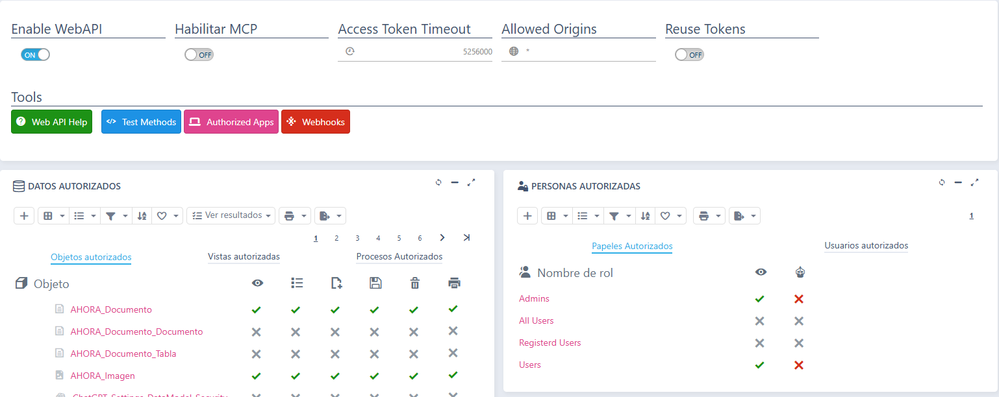

# Web API

El SAT se puede usar desde otros programas a través de su **Web API**: un ERP, una herramienta de automatización como n8n o Power Automate, una hoja de cálculo o un script pueden consultar y dar de alta partes, ver sus líneas, gestionar el material, los vehículos y los almacenes, y lanzar procesos del SAT como la solicitud de material, sin abrir la aplicación.

La API es la de Flexygo y sigue el estándar **OpenAPI**: la definición completa está en `https://<tu-aplicación>/webapi` y se puede importar en Postman o en cualquier herramienta compatible (ver [Probar la API con Postman](#probar-la-api-con-postman)). La referencia técnica de todos los métodos está en la ayuda de Flexygo, apartado *Ayuda › Programación › API Web*.

!!! warning "Usa siempre HTTPS"
    La API recibe el usuario y la contraseña para pedir el token. En producción, la aplicación tiene que publicarse con HTTPS.

## Qué se puede hacer con la API

### Objetos

| Qué se puede hacer | Objetos |
|---|---|
| **Consultar, crear, modificar y borrar** | Partes de trabajo (`sat_Parte`), material (`sat_Material`), vehículos (`sat_Vehiculo`), almacenes (`sat_Almacen`), la configuración de checklists (`sat_Checklist_Config`, sus valores `sat_Checklist_Values_Config` y a qué se aplica cada una `sat_Checklist_Config_Relation`) y los documentos e imágenes adjuntos del ERP (`AHORA_Documento`, `AHORA_Imagen`) |
| **Consultar y modificar** | Técnicos (`sat_Empleado`) |
| **Solo consultar** | Las líneas del parte: mano de obra (`sat_Parte_MO`), material (`sat_Parte_Material`), números de serie (`sat_Parte_Material_Ubic`) y desplazamientos (`sat_Parte_Desplazamiento`); la firma (`sat_Firma`), los valores de checklist (`sat_Parte_Checklist_Value`) y las notificaciones (`sat_Parte_Notificacion`) del parte; clientes (`sat_Cliente`), contactos (`sat_Contacto`), notas de cliente (`sat_Clientes_Nota`) y envíos de material (`sat_Envio`) |

Cada objeto lleva en la definición de la API una descripción de para qué sirve y de qué significan sus campos codificados (estados, tipos…). La API solo devuelve los campos que el SAT usa, no todas las columnas de las tablas del ERP.

!!! note "Los objetos `Offline_*`"
    La definición incluye también los objetos `Offline_*`, que usa la app móvil para sincronizar: cada técnico solo recibe sus partes abiertos. Para integraciones hay que usar los objetos `sat_*`.

### Vista de stock

| Vista | Qué devuelve |
|---|---|
| `sat_Material/Stock` | El stock de cada artículo por almacén, con las cantidades pendientes de recibir y de enviar |

### Procesos

| Proceso | Qué hace |
|---|---|
| `sat_Material_Solicitud_Traspaso` | Solicita material de un almacén a otro, normalmente del almacén central a la furgoneta del técnico: genera un albarán de envío. Con actualización inmediata, además mueve el stock en el momento |
| `sat_Envio_Actualizar` | Actualiza un albarán de envío pendiente: genera los movimientos de stock del almacén de origen al de destino |
| `sat_AsignarAlmacenAEmpleado` | Asigna al técnico el almacén desde el que consume material en los partes. Por defecto sustituye los que ya tuviera |
| `sat_Empleado_Generar_Usuario` | Crea el usuario de acceso a la app del SAT para un técnico y le envía un correo con las instrucciones. El técnico tiene que tener email, y el usuario cuenta para la licencia |

## La seguridad es la misma que en la aplicación

La API trabaja **con un usuario del SAT** y aplica sus permisos igual que la aplicación: lo que el usuario no puede ver o modificar en la aplicación, tampoco lo puede hacer por la API. Además, solo están disponibles las operaciones de las tablas anteriores: crear un cliente o borrar un técnico, por ejemplo, responde **403**.

Por eso conviene crear un usuario propio para cada integración, con el rol que corresponda a lo que tiene que hacer, en lugar de usar el del administrador. La solicitud de material propone como técnico el **empleado** del usuario: si la integración no indica el técnico, el usuario tiene que tener un empleado asociado.

## Activar la API

Lo hace un administrador en **Work Area › Admin Work Area › Security › WebAPI**:


*Fig.1 - Configuración de la Web API.*

1. **Enable WebAPI**: enciende la API.
2. **Datos autorizados**: los objetos, vistas y procesos del SAT ya vienen publicados con los permisos de las tablas anteriores. Aquí se pueden retirar, si en tu empresa no se quiere exponer alguno.
3. **Personas autorizadas**: en la pestaña **Papeles autorizados** (roles) o **Usuarios autorizados**, marca la columna del **ojo** en los roles o usuarios que pueden usar la API. El SAT ya trae autorizados los roles Admins y Users.

La columna del **robot** es el permiso para conectar asistentes de IA, que es otra cosa: ver [Asistentes de IA (MCP)](Asistentes%20de%20IA%20(MCP).md).

## Pedir el token

Cada llamada lleva un token, que se pide una vez con el usuario y la contraseña del SAT:

```http
POST https://<tu-aplicación>/token
Content-Type: application/x-www-form-urlencoded

grant_type=password&username=integracion&password=********
```

La respuesta trae `access_token`, que se envía después en la cabecera `Authorization` de cada llamada:

```http
Authorization: Bearer eyJhbGciOiJI...
```

## Ejemplos

Todas las direcciones empiezan por `https://<tu-aplicación>/webapi`.

**Crear un parte.** Basta con el cliente, el contacto, el técnico y la descripción:

```http
POST /webapi/object/sat_Parte
Content-Type: application/json

{ "IdCliente": "00006", "IdContacto": 31, "IdEmpleado": 1, "Descrip": "Revisión de la caldera" }
```

El ERP asigna el número de parte, y el SAT completa el resto: estado abierto, tipo, condiciones económicas del cliente, fecha de inicio (ahora) y de fin (la de inicio más el tiempo por defecto del parte, 4 horas de serie). Se pueden enviar también `FechaInicio` y `FechaFin`, por ejemplo `"FechaInicio": "2026-10-07T09:30:00"`. La respuesta trae el parte creado, con su `IdParte`.

**Ver un parte** por su `IdParte`:

```http
GET /webapi/object/sat_Parte/196
```

**Modificar un parte.** Solo hay que enviar los campos que cambian:

```http
PUT /webapi/object/sat_Parte/196
Content-Type: application/json

{ "Observaciones": "El cliente pide que se llame antes de ir" }
```

**Listar los partes abiertos de un técnico.** Cada campo codificado viene acompañado de su texto en un campo `<Campo>_flxtext` (por ejemplo, el nombre del cliente además de su código); con `withDescrips=false` solo llegan los códigos:

```http
GET /webapi/list/sat_Parte?filter=Partes.IdEmpleado=1 AND Partes.IdEstado=1&pageSize=100
```

**Ver las líneas de un parte**, por ejemplo la mano de obra:

```http
GET /webapi/list/sat_Parte_MO?filter=Partes_Lineas_MO.IdParte=196
```

**Ver los contactos de un cliente:**

```http
GET /webapi/list/sat_Contacto?filter=Clientes_Contactos.IdCliente='00006'
```

**Solicitar material** para la furgoneta de un técnico (del almacén 0 al 1):

```http
POST /webapi/exec/sat_Material_Solicitud_Traspaso/sat_Material/ART00001
Content-Type: application/json

{ "Cantidad": 2, "IdAlmacenOrigen": 0, "IdAlmacenDestino": 1, "IdEmpleado": 1, "ActualizacionInmediata": false }
```

**Actualizar el envío** que ha generado la solicitud. Los envíos se identifican por su `IdDoc`, que viene en el listado de `sat_Envio`:

```http
POST /webapi/exec/sat_Envio_Actualizar/sat_Envio/5
{ "Revisado": false }
```

**Consultar el stock:**

```http
GET /webapi/list/sat_Material/Stock
```

### Los filtros

El parámetro `filter` es una condición SQL sobre los campos del objeto. Para evitar ambigüedades, conviene poner delante el nombre de la tabla:

| Objeto | Tabla |
|---|---|
| Partes | `Partes` |
| Líneas de mano de obra, de material y de desplazamientos | `Partes_Lineas_MO`, `Partes_Lineas_Mat`, `Partes_Lineas_Desp` |
| Clientes | `Clientes_Datos` |
| Contactos | `Clientes_Contactos` |
| Material y vehículos | `Articulos` |
| Almacenes | `Almacenes` |
| Técnicos | `Empleados_Datos` |
| Envíos de material | `sat_vAlbaranes_Envio` |

En la dirección, el filtro tiene que ir codificado (`%25` en lugar de `%`, `%20` en lugar de los espacios…); Postman y la mayoría de herramientas lo hacen solas. El filtro siempre se suma a la seguridad del usuario: no sirve para ver más de lo que el usuario puede ver. Por seguridad, la API **rechaza** los filtros con comentarios (`--`, `/* */`), con `;` o con paréntesis o comillas sin cerrar.

## Probar la API con Postman

Postman puede cargar la definición de la API y crear una colección con todas las llamadas:

1. En Postman, **Import** y pega la dirección `https://<tu-aplicación>/webapi`. No hace falta token para importarla.
2. Postman crea una colección con el nombre de la aplicación, con una carpeta por objeto y las llamadas de cada uno: listar, ver por id, crear, modificar, vistas y procesos.
3. En la pestaña **Authorization** de la colección ya viene configurado **OAuth 2.0** con el tipo *Password Credentials* y la dirección del token. Escribe el usuario y la contraseña del SAT, pulsa **Get New Access Token** y después **Use Token**.
4. La dirección de la aplicación está en la variable `baseUrl` de la colección. Si la aplicación está detrás de un proxy y la dirección no es la correcta, cámbiala ahí.

También puedes consultar la referencia de la API en el navegador, en `https://<tu-aplicación>/scalar`.

## Si algo no sale

| Respuesta | Por qué | Qué hacer |
|---|---|---|
| **401** | Falta el token o ha caducado | Pide un token nuevo |
| **403** | El objeto o el proceso no está publicado, la operación no está permitida (por ejemplo, crear un cliente), o el usuario no tiene permiso de API | Revisa **Datos autorizados**, **Personas autorizadas** y el rol del usuario |
| **400** | El filtro no es válido, o falta un campo obligatorio | El mensaje dice qué falla |
| **404** | El registro sobre el que se lanza un proceso no existe | Revisa el id de la dirección |
| **500** con un mensaje del SAT | Una regla del SAT o del ERP ha rechazado la operación, como solicitar material con el mismo almacén de origen y de destino, o crear el usuario de un técnico que ya lo tiene | El motivo viene en el campo `InnerMessage` de la respuesta |
