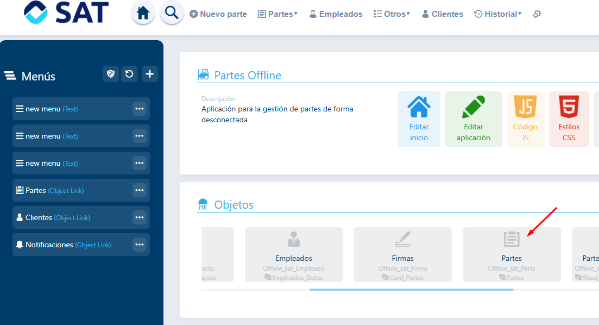
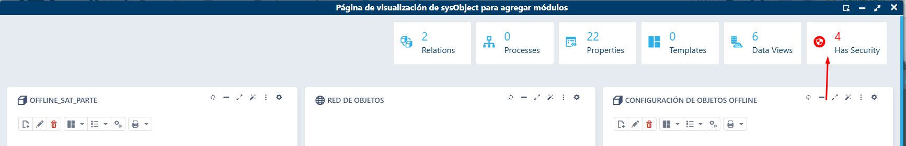
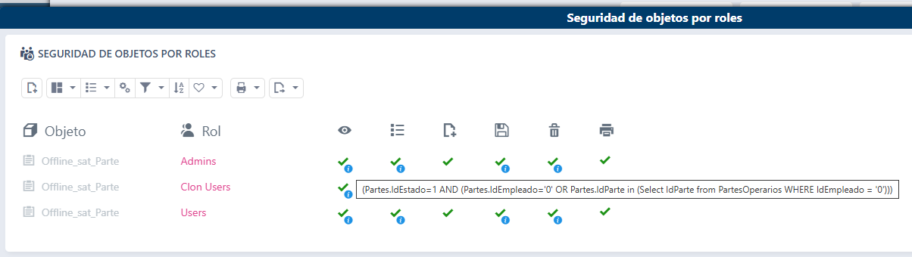

# ¿Sabías que puedes restringir la información que se envía a la aplicación offline?

En el propio diseñador de la aplicación offline, es posible aplicarle seguridad accediendo a cada uno de los objetos, así podemos restringir la información que le llegará a cada usuario.

Por ejemplo en el caso de los partes:

Esto nos va a permitir que cada usuario solo reciba los partes en los que tenga que intervenir.
