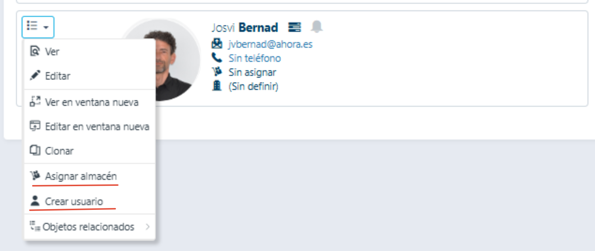

# ¿Sabías que desde la propia ficha del empleado puedes crear el usuario asociado o asignarle un almacén?

Para acceder a ambos apartados bastará con ir al apartado de empleados,

y sobre cada ficha desplegar el menú de procesos asociado:

